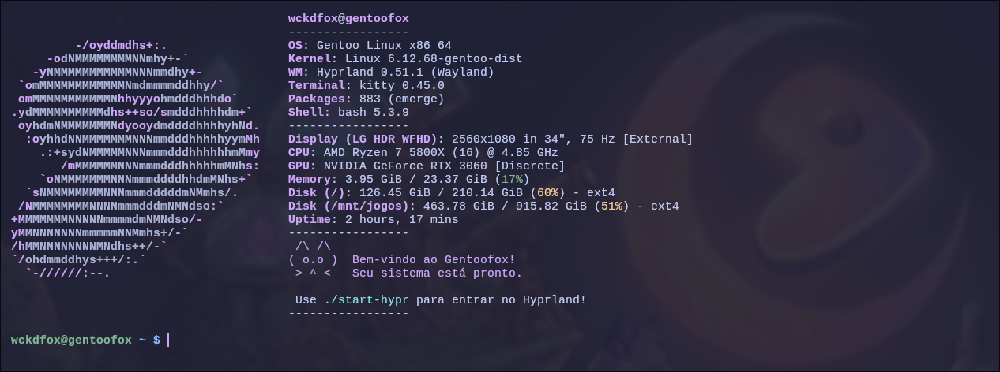
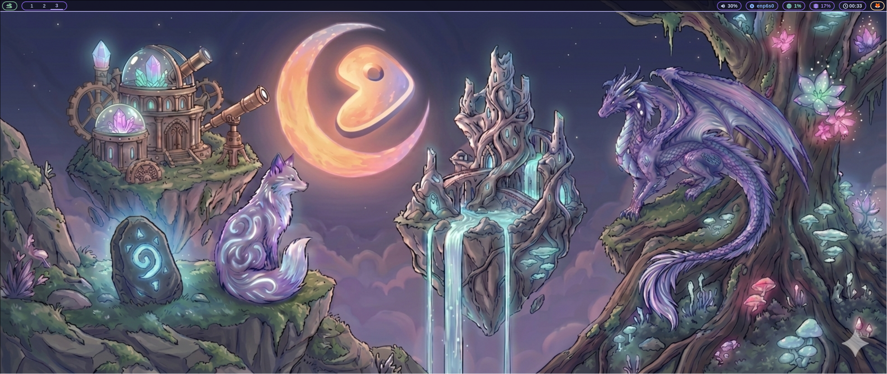
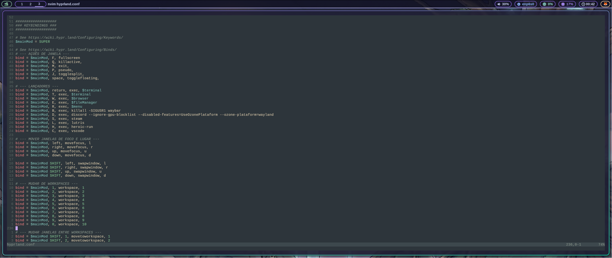
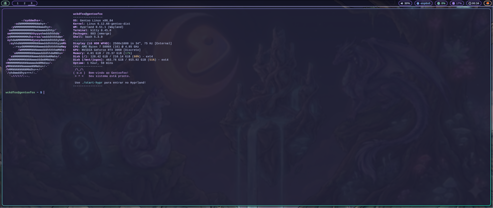
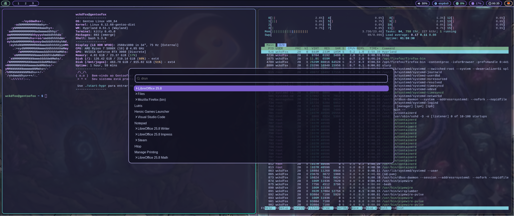
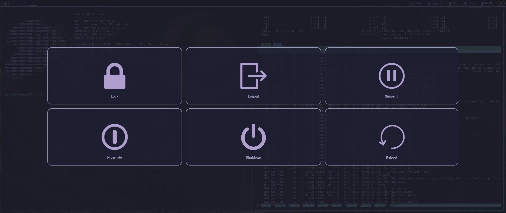

# 🦊 GentooFox Dotfiles 🌿

Repository containing my personal configuration files for **"GentooFox"** Linux and Hyprland.

## 🚀 About

This repository serves as a backup and version control for my desktop environment and development setup. It contains configurations for Hyprland, Waybar, Portage, terminals, themes, and development tools.

## ✨ Features

- Hyprland
- Waybar
- Wofi
- Wlogout
- Kitty
- Neovim
- Fastfetch
- Gentoo Portage configuration
- Wallpapers

## ⚙️ Portage

Custom Gentoo configurations:

- `make.conf`
- `package.use`
- `package.accept_keywords`
- `package.mask`
- `package.unmask`
- `repos.conf`

## 📂 Repository Structure

```text
gentoo-dotfiles/
├── install.sh
├── README.md
├── screenshots/
├── home/
│   └── .bashrc
├── config/
│   ├── hypr/
│   ├── waybar/
│   ├── wofi/
│   ├── wlogout/
│   ├── kitty/
│   ├── fastfetch/
│   └── nvim/
├── portage/
│   ├── make.conf
│   ├── package.use/
│   ├── package.accept_keywords/
│   ├── package.mask/
│   ├── package.unmask/
│   ├── package.license/
│   └── repos.conf/
└── wallpapers/
```

## ▶️ Running the Project

1. Open your terminal and clone this repository:

```bash
git clone https://github.com/MayllaRabay/gentoo-dotfiles.git
```

2. Navigate to the script project folder:

```bash
cd gentoo-dotfiles/scripts
```

3. Make the installation script executable:

```bash
chmod +x install.sh
```

4. Run the script:

```bash
./install.sh
```

5. After installation, reload your shell:

```bash
source ~/.bashrc
```

To apply Hyprland changes without logging out:

```bash
hyprctl reload
```

To reload Waybar:

```bash
killall -SIGUSR1 waybar
```

## 📸 Screenshots











## 📜 License

This project is available for educational and personal use.

### Made with 💜 by Maylla Rabay
